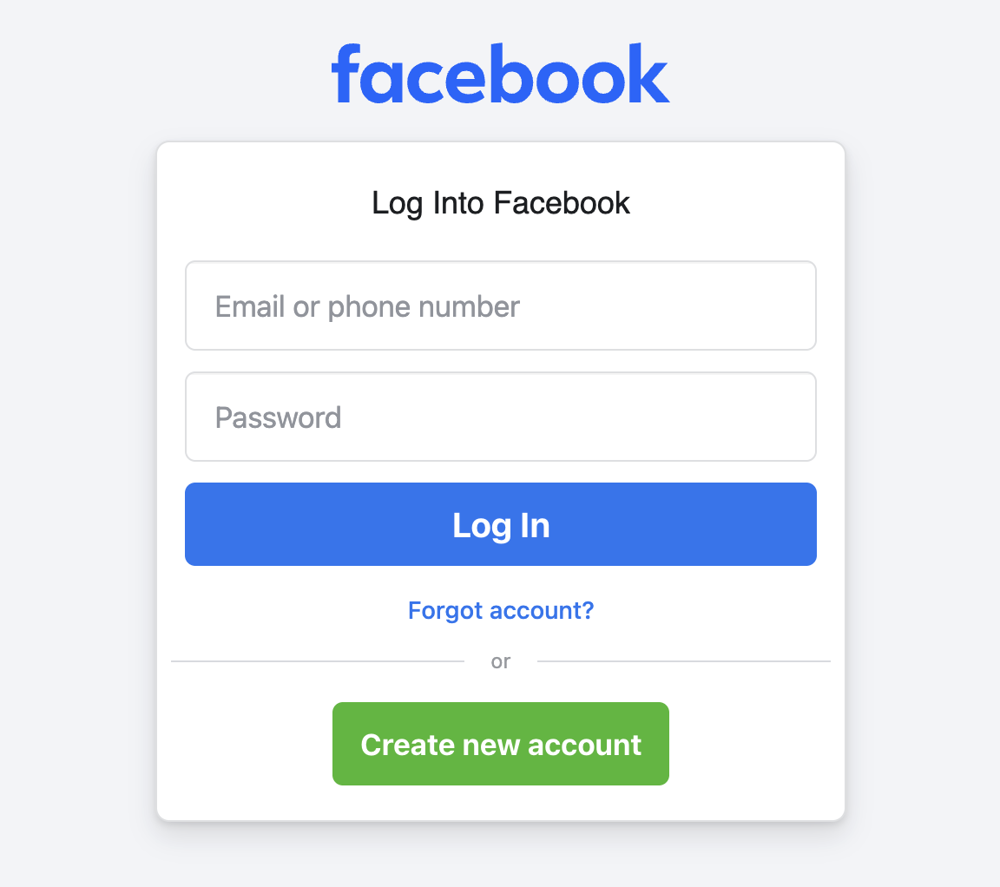
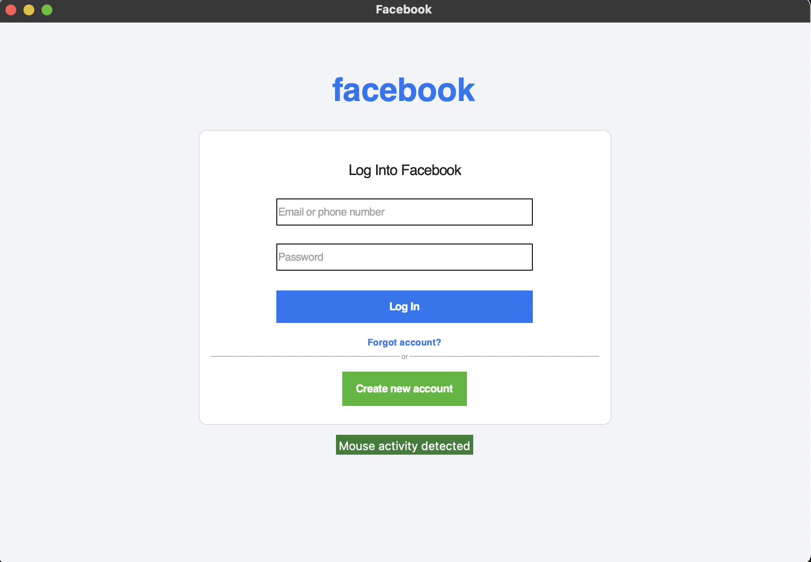
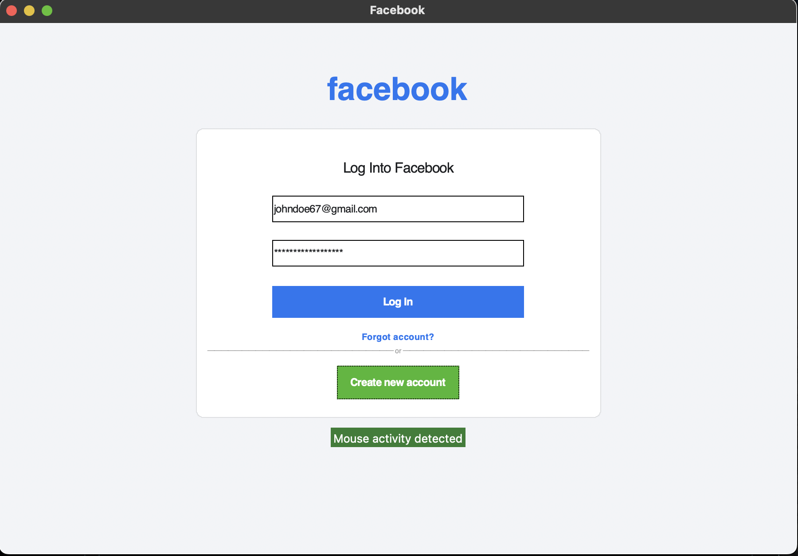
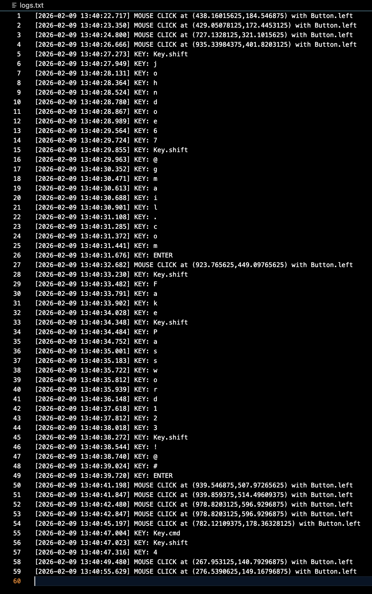
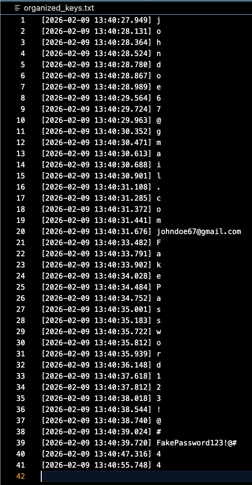

# KeyLogger (Educational Project)

## 📌 Project Description

I built a keylogger that captures and saves keyboard strokes and mouse clicks. This program is an **event-driven Python application** that captures keyboard and mouse input while displaying a graphical user interface (GUI). It logs raw input events with timestamps and also organizes typed keystrokes into readable text output. The project is intended for **educational and learning purposes**, such as understanding event listeners, GUI integration, logging systems, and input handling.

The application runs a Tkinter-based UI and uses global input listeners to monitor keyboard and mouse activity while the program is active. I created a fake Facebook page to demonstrate how a keylogger works in a real setting.

---

## 🛠 Features

- Global keyboard and mouse input monitoring
- Timestamped logging of raw input events
- Organized reconstruction of typed text (handles space, backspace, and enter)
- Graphical user interface built with Tkinter
- Graceful shutdown with safe data flushing

---

## 🧩 Project Structure

- main.py # Application entry point and orchestration
- filemanager.py # File I/O abstraction and persistence logic
- logger.py # Buffered interaction logger
- input_handlers.py # Keyboard and mouse event handling
- ui.py # GUI layout and construction
- ui_helpers.py # UI utility functions and custom widgets
- logs.txt # Raw input log output
- organized_keys.txt # Organized keystroke output

---

## 🧠 How It Works (High-Level)

1. The program initializes file managers, a buffered logger, and the GUI.
2. Global keyboard and mouse listeners run asynchronously.
3. Each input event is timestamped and logged.
4. Keyboard input is additionally processed into readable text sequences.
5. Logs are written to disk using buffered appending.
6. On program exit, all remaining data is safely flushed and listeners are stopped.

---

## Required Permissions (Important)

Because this program monitors **global keyboard and mouse input**, most operating systems require explicit user permission for the application or terminal running it.

If permissions are not granted, the program may fail silently or not capture any input.

### macOS Example (VS Code)

If you are running this program on **macOS using VS Code**, you must enable accessibility permissions:

1. Open **System Settings**
2. Go to **Privacy & Security**
3. Select **Accessibility**
4. Enable **Visual Studio Code**
5. (If using the integrated terminal) also ensure your **Terminal** or shell app is enabled

After enabling permissions, **restart VS Code** before running the program again.

### Other Platforms

- **Windows:** May require running the terminal or IDE with appropriate privileges.
- **Linux:** Permissions depend on the desktop environment and input system.

---

## ⚙️ Usage Notes

- The program only records input **while it is running**.
- Logged data is stored locally in plain text files.
- This project should be used **only in environments where you have permission to monitor input**.
- Do not use keylogger software to capture sensitive data from others without consent.

---

## How to Run Program

After getting proper permissions from system settings (as described in Required Permissions section above), simply compile and run main.py. You can enter command: `python3 main.py` in your terminal that has proper permissions.

---

## 🚨🚨🚨🚨 Disclaimer 🚨🚨🚨🚨

This project is intended for **educational and experimental purposes only**. Monitoring keyboard and mouse input can have legal and ethical implications. Always ensure you have proper authorization and follow applicable laws and platform policies.

---

## 🧪 Exhibit

### Exhibit A: Real Facebook login page vs UI Facebook login page (fake)

**Description:**  
This exhibit shows the real Facebook login page vs the UI created Facebook login page. Can you guess which one is the real one?

### Exhibit B: Entering Facebook login credentials

**Description:**  
Here, John Doe is unsuspectively entering his Facebook login credentials. He is unaware that a keylogger has been deployed on his system and is logging his email and password. 

### Exhibit C: Captured Logs

**Description:**  
This is what the program captures. Notice all the entries. It shows a timestamp followed by the type of input. KEY represents a keyboard stroke. MOUSE CLICK represents the mouse being clicked, along with the position of the mouse on the screen. Button represents which button was clicked (left or right). 

### Exhibit D: Organized keys

**Description:**  
After logs are captured, keys are process to create sequences of keyboard input. 

---

## License

This project is provided as-is for learning and experimentation.

---

## 👤 Author
- **Christian Ruiz**  
  Cybersecurity Researcher
  GitHub: https://github.com/cr-droid
